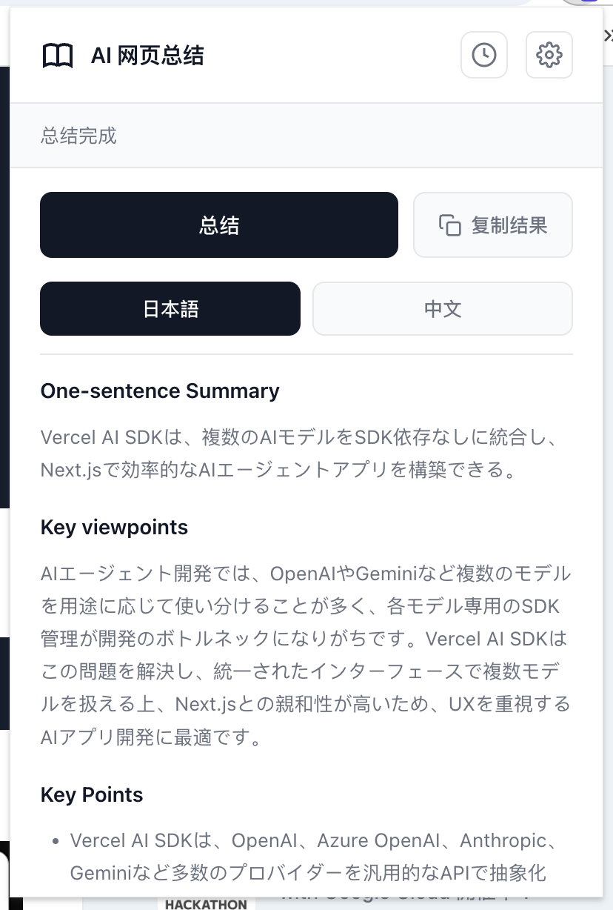
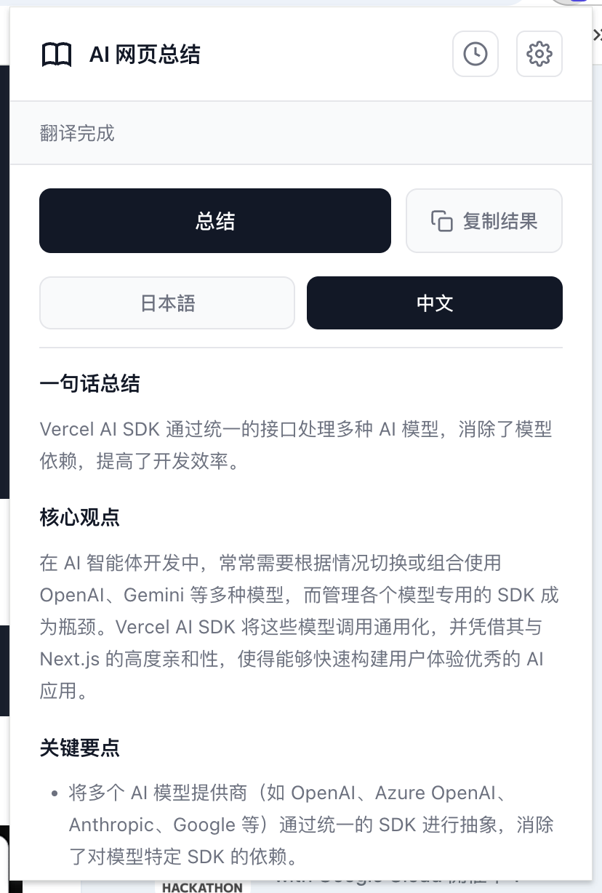
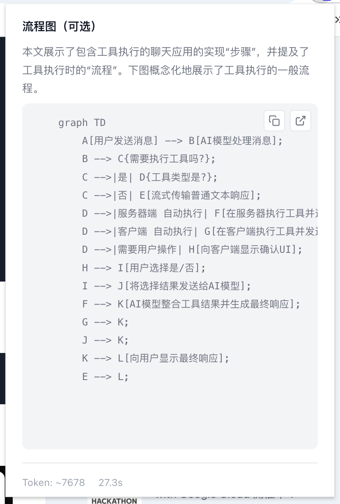

# AI 网页总结

一个 Chrome 扩展，使用 AI 快速总结任意网页内容。支持多种主流 AI 模型 API。


## 功能特性

- **智能总结**：使用 AI 分析并总结网页核心内容
- **多语言支持**：自动识别语言，支持中英日韩等语言
- **双语对照**：原文与中文翻译一键切换
- **Mermaid 流程图**：支持展示流程图代码，并提供在线编辑入口
- **历史记录**：自动保存总结历史，方便回顾
- **图片提取**：识别并展示页面相关图片
- **进度保存**：意外关闭页面后可恢复总结进度

## 支持的 AI 模型

| 模型提供商 | 推荐模型 |
|-----------|---------|
| DeepSeek | deepseek-chat |
| OpenAI | gpt-3.5-turbo |
| 智谱 AI | glm-4-flash |

## 安装方法

### 1. 开发模式安装

1. 克隆或下载本项目到本地
2. 打开 Chrome 浏览器，访问 `chrome://extensions/`
3. 开启右上角的「开发者模式」
4. 点击「加载已解压的扩展程序」
5. 选择本项目文件夹即可安装

### 2. 更新扩展

更新代码后，在扩展管理页面点击「重新加载」即可。

## 使用方法

1. **配置 API Key**
   - 点击扩展图标右上角的设置按钮
   - 选择 AI 服务提供商
   - 输入对应的 API Key

2. **总结网页**
   - 打开任意网页
   - 点击扩展图标
   - 点击「总结当前页面」按钮
   - 等待 AI 生成总结

3. **查看流程图**
   - 如果内容包含流程图，会显示 Mermaid 代码块
   - 悬停代码块可显示操作按钮
   - 点击复制按钮复制代码
   - 点击跳转按钮在 [Mermaid Live](https://mermaid.live/edit) 中在线编辑

## 界面预览

### 总结结果展示

<div style="display: flex; gap: 20px; align-items: flex-start;">
  
  
</div>

### Mermaid 流程图支持



## 隐私说明

- API Key 仅存储在本地 Chrome 存储中
- 页面内容仅用于调用 AI API 进行总结
- 不会收集或上传任何个人数据

## 技术栈

- **Chrome Extension API**: 扩展核心框架
- **Marked.js**: Markdown 渲染
- **Mermaid.js**: 流程图渲染
- **AI APIs**: DeepSeek / OpenAI / 智谱 AI

## 文件结构

```
web-summarizer/
├── manifest.json        # 扩展配置文件
├── popup.html          # 弹窗界面
├── popup.js            # 弹窗逻辑
├── content.js          # 内容脚本
├── background.js       # 后台脚本
├── options.html        # 设置页面
├── options.js          # 设置逻辑
├── styles.css          # 样式文件
├── marked.min.js       # Markdown 解析库
├── mermaid.min.js      # 流程图渲染库
└── icons/              # 图标资源
```

## 常见问题

**Q: 总结失败怎么办？**
A: 请检查：
1. API Key 是否正确配置
2. 网络连接是否正常
3. 页面内容是否足够（太短的页面无法总结）

**Q: 支持哪些浏览器？**
A: 目前仅支持 Chrome 浏览器。

**Q: API Key 安全吗？**
A: API Key 存储在本地，不会被上传。如有顾虑，请勿在公共设备上使用。

## 许可证

MIT License
